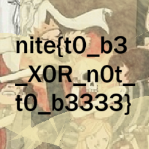

# 1. All stars align.
Given is two files one being the output of the py file and the py script itself.

## Flag:
```nite{r3s1du35_f4ll1ng_1nt0_pl4c3}```

## Solution
The generator utilises a large prime p. For each bit of the flag, the generator outputs either a a * x (mod p) if the bit is 0, and a * (-x) (mod p) if the bit is 1.
Wherein x is a fresh random quadratic residue (QR) modulo p. (By definition, a QR has Legendre symbol +1.)
Now looking into number theory and finding the Legendre symbol Xp(n) = n^{(p-1)/2} * mod p equals +1 if n is a QR, -1 if n is a non-residue. It is also to note thar it’s multiplicative i.e: Xp(uv) = Xp(u)*Xp(v). An integer a is a quadratic residue (mod n) if there exists an integer x such that x^{2} == a (mod n). If no such integer x exists, a is called a quadratic non-residue. 

Now implemending this Legendre rulebook into our logic, we create a py script to create two sets of bitstings to see what in the .txt file matches a QR or non-residue. We check for both -1 and 1 (for bit 1 and 0)

```py
import ast
from chal import p  # assumes chal.py defines the prime p

with open("out.txt") as f:
    arr = ast.literal_eval(f.read())

# Legendre symbol (+1 for QR, -1 for QNR)
def legendre(n, p):
    return 1 if pow(n % p, (p - 1) // 2, p) == 1 else -1
syms = [legendre(x, p) for x in arr]
base = syms[0]
bits0 = ''.join('0' if s == base else '1' for s in syms)
bits1 = ''.join('1' if s == base else '0' for s in syms)
def bits_to_bytes(b):
    pad = (8 - len(b) % 8) % 8
    b = '0' * pad + b
    return int(b, 2).to_bytes((len(b) // 8), 'big')
c0 = bits_to_bytes(bits0)
c1 = bits_to_bytes(bits1)
try:
    print(c0.decode())
except:
    print(c0)
try:
    print(c1.decode())
except:
    print(c1)
```

## Concepts Learnt
This challenge delved a lot into number theory which required a lot of reading from my end and further exprementation with file structures in python as well as importing values from different programs. Also worked with big-endian bytes and their respective manipulation. ast.literal_eval safely turns the text in out.txt into a real Python list.

## Notes
None to note here, had to exprement with math functions quite a bit and work around diffenent permutations to make the logic work. Struggled to understand why we needed two outputs from the program which required further reading. 

## References
https://xanhacks.gitlab.io/ctf-docs/crypto/modular-arithmetic/02-quadratic-residue/
https://crypto.stanford.edu/pbc/notes/numbertheory/qr.html
https://cryptohack.org/courses/modular/root1/

*** 

# 2. Residue Refinery
Given is a .py script which takes a FLAG (from secret.py) and extracts the inner bytes which are processed in 2-byte blocks. Each 2-byte block is interpreted as a field element in the quadratic extension F {257}[x] / (x^2 - 3), i.e. as a0 + a1 * x with coefficients reduced modulo 257. To all of this, a random 2-byte secret key ks = os.urandom(2) is created, also treated as a field element k = k0 + k1 * x. Each plaintext pair generated is multiplied with this key. The script writes the product into the ciphertext ct in reversed order for each pair. Finally it prints the ciphertext hex.

## Solution
Therefore we can deduce that the ciphertext field element is r = k * p. The nuance is that the script writes this cipher in a reversed pairing, [r1, r0] instead of [r0, r1]. Now Using the multiplication formulas:
r0 = k0 * p0 + 3k1 * p1 mod(257) and r1 = k0 * p1 + k1 * p0 mod(257).
Using known values of p0 and p1 we get a 2x2 linear system which we can solve for using Gaussian Elimination. From the values p0 = 49 and p1 = 109, we get the value of the key k0 = 60 and k1 = 6 mod (257). Now we calculate the inverse of k using the norm N(k) = k0^2 - 3 * k1^2 mod(257). This equals 151 mod(257). k^-1 = 174 + 34x mod (257) via the formula k^-1 = (k0 - k1x)/N(k) (after calculating multiplicative inverse of N too). 
Utilising this blueprint into a py script, 
```py
p = 257

def mul(a, b):    
    a0,a1 = a; b0,b1 = b
    r0 = (a0*b0 + 3*a1*b1) % p
    r1 = (a0*b1 + a1*b0) % p
    return (r0, r1)
def inv(k):
    k0,k1 = k
    norm = (k0*k0 - 3*k1*k1) % p
    inv_norm = pow(norm, -1, p)
    return ((k0*inv_norm) % p, (-k1*inv_norm) % p)
k = (60, 6)
k_inv = inv(k)  
ct_hex = "9813d3838178abd17836f3e2e752a99d5cd3fba291205f90c1d0a78b6eca"
ct = bytes.fromhex(ct_hex)
plain = bytearray()
for i in range(0, len(ct), 2):
    r1 = ct[i]
    r0 = ct[i+1]
    r = (r0, r1)
    p0 = (k_inv[0]*r[0] + 3*k_inv[1]*r[1]) % p
    p1 = (k_inv[0]*r[1] + k_inv[1]*r[0]) % p
    plain += bytes([p0, p1])
print(plain)      
print("nite{" + plain.decode() + "}")
```

## Flag
```
nite{1mp0r7_m0dul3?_1_4M_7h3_m0dul3}
```

## What I learned
This was a lot more applied theory over actual coding. This challenge delved a lot into math in the sense of utilising Finite fields over extension field arithmetic which required a lot of devotion on my end to reading up on various theorems and understanding how hidden field equations can be used to decrypt the cuiphertext. 

## Notes
None to place here

## References
https://wentelteefje.github.io/posts/post-003/
https://en.wikipedia.org/wiki/Hidden_Field_Equations
https://web.stanford.edu/~marykw/classes/CS250_W19/readings/Forney_Introduction_to_Finite_Fields.pdf

***

# 3. Quixorte
We're given an encrypted png with a ciphered header which is rotated by the chall.py file given to us.

## Solution
The challenge script performs the following operations over the bytes. The first being that of rotating each byte of the header by 8 bits to the right by performing i % 8 where i is the position the the byte. This is futher made complex by performing a sliding XOR with an unknown 8-byte key. Now we can tell that the initial byte rotation by 8 can easily be reversed but the unknown key throws us off. We know XOR'ing a ciphered XOR gives us the original plaintext (i.e we can cancel it out). 
We also know the first 8 bytes of a PNG must be: 89 50 4E 47 0D 0A 1A 0A
Every time the XOR window moves one step forward, the same key is XORed again onto the next 8-byte chunk with 0'th byte being hit once, 1st being hit twice and so on. We do this slide twice to cancel out the encryption and generate the key. We finally undo the rotation by moving the set left by i%8 and get the fixed header. 

```py
#!/usr/bin/env python3
from pathlib import Path
KEYLEN = 8
PNG_MAGIC = b'\x89PNG\r\n\x1a\n'
def ror8(b: int, shift: int) -> int:
    """Rotate byte right by (shift % 8)."""
    s = shift & 7
    return ((b >> s) | ((b << (8 - s)) & 0xFF)) & 0xFF
def rol8(b: int, shift: int) -> int:
    """Rotate byte left by (shift % 8)."""
    s = shift & 7
    return (((b << s) & 0xFF) | (b >> (8 - s))) & 0xFF
enc = Path("quote.png.enc").read_bytes()
n = len(enc)
rot_header = bytes(ror8(b, i) for i, b in enumerate(PNG_MAGIC))
prefix = bytes(e ^ r for e, r in zip(enc[:KEYLEN], rot_header))

key = bytearray(KEYLEN)
key[0] = prefix[0]
for i in range(1, KEYLEN):
    key[i] = prefix[i] ^ prefix[i - 1]
key = bytes(key)
buf = bytearray(enc)
for i in range(n - KEYLEN + 1):
    for j in range(KEYLEN):
        buf[i + j] ^= key[j]
plain = bytearray(n)
for i, b in enumerate(buf):
    plain[i] = rol8(b, i)
out_path = Path("quote.png")
out_path.write_bytes(plain)
ok = plain.startswith(PNG_MAGIC)
print(f"[+] Key (hex): {' '.join(f'{x:02x}' for x in key)}")
print(f"[+] Wrote {out_path} ({n} bytes)")
print("[+] PNG header OK" if ok else "[!] Warning: PNG header not detected")
```

Fixing the header and opening the file we get:



## Flag
```
nite{t0_b3_XOR_n0t_t0_b3}
```

## What I learned
This challenge required the understanding of how we can reverse-engineer the XOR slide the challenge script does over the png header to encrypt it. Our solve also uses pathlib to work with files again and the use of `PNG_MAGIC = b'\x89PNG\r\n\x1a\n'` gives us the exact binary of the PNG header we used to verify the decryption. 

## Notes
This challenge took an aggregious amount of time to solely understand the XOR slide which was excruciatingly hard. The code to overwrite the png header failed multiple times forcing me to reseach online. 

## References
https://realpython.com/python-pathlib/
https://www.geeksforgeeks.org/dsa/rotate-bits-of-an-integer/
https://en.wikipedia.org/wiki/Circular_shift
https://www.geeksforgeeks.org/dsa/prefix-xor-array/
https://www.faanross.com/firestarter/reflective/module07/rolling/


***

# 4. Willy's Chocolate Experience.
Given is a py script which defines a linear reccurence modulo over a large prime p which is defined in the program.

## Solution
The program excutes this formula a(m) = 13^m + 37^m * mod(p). We get the computed last two terms of the sequence which are leftover = [a(n-1), a(n)]. We are to find n = bytes_to_long(b"nite{...}") which we can convert back into bytes to obtain the flag. The script defines b and c as ``` b = (37 * a_nm1 - a_n) % p && c = (a_n - 13 * a_nm1) % p```. Upon computing this, we get `b = 24 * 13^(n-1) * mod p` AND `c = 24 * 37^(n-1) * mod p`. 
Upon taking the ratio c/b, we get c * b^-1 * mod p and 37 * 13^-1 * mod p. This ratio is calculated by using moduluar inverses. We further get this clean equation g^(n-1) == r * mod p. Where g = 37/13 (mod p) and r = c/b (mod p). 

This equation is a question under the discrete logarithm problem from which we take the help of sympy to smoothen out the math here. Decoding this integer n we get from sympy to UTF-8 text we get the flag.

This is the final script used. 

```py
from sympy import discrete_log

p = 396430433566694153228963024068183195900644000015629930982017434859080008533624204265038366113052353086248115602503012179807206251960510130759852727353283868788493357310003786807

a_nm1 = 124499652441066069321544812234595327614165778598236394255418354986873240978090206863399216810942232360879573073405796848165530765886142184827326462551698684564407582751560255175
a_n   = 208271276785711416565270003674719254652567820785459096303084135643866107254120926647956533028404502637100461134874329585833364948354858925270600245218260166855547105655294503224

modinv = lambda x: pow(x, -1, p)

# From the algebra:
# b = 37*a_{n-1} - a_n  = 24 * 13^{n-1}
# c = a_n - 13*a_{n-1} = 24 * 37^{n-1}
# r = c / b = (37/13)^{n-1}  (mod p)
b = (37 * a_nm1 - a_n) % p
c = (a_n - 13 * a_nm1) % p

g = (37 * modinv(13)) % p   # base  = 37/13 (mod p)
r = (c * modinv(b)) % p     # value = g^(n-1) (mod p)

x = discrete_log(p, r, g)   # solve g^x = r (mod p)
n = x + 1                   # x = n-1

# int -> bytes -> flag
flag = n.to_bytes((n.bit_length() + 7) // 8, "big")
print(flag.decode())
```

## Flag
```
nite{g0ld3n_t1ck3t_t0_gl4sg0w}
```

## What I learned
This challenge required a lot of understanding on number theory, requiring the use of discrete log, modular arithmetic and more. I also learnt how sympy can be used in this instance to speed up and clean over excess math in the script.

## Notes
None to note here, took me a while to figure out that sympy could be used to calculate the discrete log. 

## References
https://docs.sympy.org/latest/modules/ntheory.html#sympy.ntheory.residue_ntheory.discrete_log
https://www.khanacademy.org/computing/computer-science/cryptography/modern-crypt/v/discrete-logarithm-problem
https://en.wikipedia.org/wiki/Discrete_logarithm
https://www.geeksforgeeks.org/engineering-mathematics/modular-arithmetic/
https://en.wikipedia.org/wiki/Linear_recurrence_with_constant_coefficients


***

# 5. spAES Oddity
Given is two py scripts one being to generate and randomise a flag and key respectively. The second is the script of the oracle which we interact with, asking us to input a value in hex which it encodes after enforcing the length of the message to be odd. cipher = AES.new(KEY, AES.MODE_ECB) creates an AES cipher object in ECB mode with the secret KEY where the block size is 16 bytes. pad(message + FLAG, 16) concatenates your message and the secret flag i.e pads the result to a multiple of 16 bytes using PKCS#7 padding. cipher.encrypt(...) encrypts the padded bytes with AES-ECB. After all this, the code finally returns the ciphertext as a hex string. 

## Solution
We can see that the challenge forces us to employ and ECB-oracle attack which essentially brute-forces the solution out of the oracle by placing various permutations of flag bytes at positions and pad them over to build a dictionary of ciphertext blocks for each possible next byte, then comparing these blocks to discover the correct byte. The fact that our program asserts an odd length forces us to move across 2 bytes at a time instead of once. We need a script to keep track of bytes of FLAG we've already discovered (f). As well as, for each step, requiring a padding length so that the next unknown 1 or 2 bytes end at the end of some 16-byte block. Thus brute-forcing the next 1 or 2 bytes by comparing blocks. 


```py
from pwn import *
import binascii, string, itertools
io = remote('spaesoddity.nitephase.live', 45673)
CS = string.ascii_lowercase + "ABCD" + "01234" + "-_{}"
B = 16
def enc(p):
    io.recvuntil(b'input in hex:')
    io.sendline(binascii.hexlify(p))
    r = io.recvline().strip().decode()
    if "Major Tom" in r:
        return None
    return binascii.unhexlify(r)
def main():
    f = b""
    print("[*] Starting...")
    while not f.endswith(b"}"):
        pad = (B - 1 - len(f)) % B
        n = 1
        if pad % 2 == 0:
            pad -= 1
            n = 2
        P = b"A" * pad
        ct = enc(P)
        if not ct:
            break
        i = (pad + len(f) + n) // B - 1
        s, e = i * B, (i + 1) * B
        tgt = ct[s:e]
        print(f"[?] Known: {f.decode(errors='ignore')} | {n} byte(s)")
        found = False
        for tup in itertools.product(CS, repeat=n):
            g = "".join(tup).encode()
            t = enc(P + f + g + b"X")
            if t and t[s:e] == tgt:
                f += g
                found = True
                break
        if not found:
            print("[!] No match, stopping.")
            break
    print("\n[+] FLAG:", f.decode(errors='ignore'))
    io.close()
if __name__ == "__main__":
    main()
```

The enc function takes a bytes payload p (this is message to the oracle). Hex-encodes it (binascii.hexlify(p)) and sends it to the server. Reads one line back. If the line contains "Major Tom", that means the server rejected it, returning None. Otherwise, it treats it as hex ciphertext and turns it into raw bytes with unhexlify.

The main function pads the guesses over, brute-forcing the flag. Modifying guess-bytes in accordance to whether the payload is odd or not. Then, when we include P + f + guess, and if that segment has an exact block length (even), we add one dummy byte to make the total length odd again. Over here, P = the padding prefix we control(the number of 'A''s we place in front of everything); f is the flag bytes we’ve already recovered so far and guess / g are the next byte(s) we’re trying to discover. 


## Flag
```
nite{D4v1d_B0w1e} 
```

## What I learned
This required a deep understanding on ECB-oracle encryption attacks which took a great deal of fiddling on my end and external help in creating the brute script to break the oracle. There where a lot of resources which I had read over to understand the logic to implement. I may have left a few as I can't jog my mind to what I read. 

## Notes
None to note here, couple of issues I ran into while localhosting via docker, couple of issues with the assertion of the flag being 49 characters while the flag was of 16 characters creating some issues with the feedback loop, changed the .env file and the challenge was up and running. Figuring out padding took over a month of research. 

## References
https://en.wikipedia.org/wiki/Block_cipher_mode_of_operation
https://node-security.com/posts/cryptography-byte-by-byte-ecb-decryption/
https://www.kristofferopsahl.com/breaking-aes-ecb-with-an-encryption-oracle-attack/
https://en.wikipedia.org/wiki/Padding_oracle_attack
