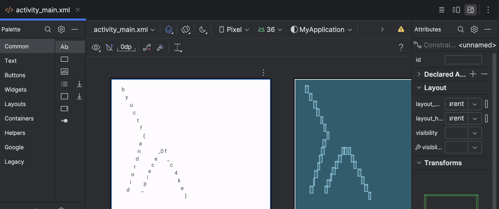

# 1. Joy Division
Given is an ELF file along with a 296-byte flag.txt file.

## Solution
We observe upon disassembling the file in ghidra that the program opens up palatinepackflag.txt in read mode. We then store this data(i.e length of the .txt file) in local_7c register via the file-pointer local_78. The program reads a bunch of characters of the length local_7c in a buffer from where a function flipBits is called on local_68 (the buffer) and local_7c. After which a function expand is called thrice, essentially quadrupling the buffer size. This scrambled and final data is stored in local_50.

FInally the program more or less prints all local_7c * 8 bytes of local_50 to stdout which then writes them to flag.txt in binary form. This is the file provided to us.

That flag.txt is exactly 296 bytes long, thus giving us the fact that the original flag is 37 bytes long. 
Note that the flipbits function more or less traverses over the buffer and at even or odd indexes, performs bitwise NOT or bitwise XOR with a key at local_11 (==0x69) after which local_11 += 0x20 (mod 256). 

Now we can easily reverse the process of NOT and XOR if we know the key. 
 
```py
#!/usr/bin/env python3
import base64
cipher_b64 = (
    "nJaYNhiKPraYERE6Hj2/vJGcGjERkDC6nhfzPR+zsbqXkpw8GpYysZEdxTAQObOwkZgeNxOcNL2fE6cz"
    "Eb+1vJSekDIcgja8mhmpNhI1t7qclBI9Fcg4sJAfSzkTu7m4mpqUOB7OOreTFW08FDG7vJ2QFjMXpDyz"
    "kRsfPxW3vbaclpg+ELo+spwRMTIWPb+7n5waORnAMLaSF7M1F7OxvJqSnDQSxjK9lR3lOBg5s7ybmB4/"
    "G7w0uZMTlzsZv7W2m56QOhSiNrieGak+GjW3sZyUEjUdyDi8lB9bMRu7ubadmpQwFq46s5cVfTQcMbu8"
    "nZAWOx+0PL+VG383Hbe9uJyWmDYYuj6+kBFROh49v7mRnBoxEbAwspYX8z0fs7G0n5KcPBr2Mrk="
)
def flip_bits(data):
    b = False
    k = 0x69
    for i in range(len(data)):
        if b:
            data[i] ^= k
            k = (k + 0x20) & 0xFF
        else:
            data[i] = (~data[i]) & 0xFF
        b = not b
    return data
def expand_inv(data):
    assert len(data) % 2 == 0
    out = bytearray(len(data) // 2)
    b = False
    k = 0x69
    for i in range(len(out)):
        o0 = data[2 * i]
        o1 = data[2 * i + 1]
        if b:
            c_high = o0 & 0xF0
            c_low  = o1 & 0x0F
        else:
            c_low  = o0 & 0x0F
            c_high = o1 & 0xF0
        out[i] = c_low | c_high
        k = (k * 0x0B) & 0xFF
        b = not b
    return bytes(out)

def main():
    data = base64.b64decode(cipher_b64)
    for _ in range(3):
        data = expand_inv(data)
    data = flip_bits(bytearray(data))
    flag = data.decode("ascii", errors="ignore").rstrip("\x00")
    print(flag)
if __name__ == "__main__":
    main()
```

This script essentially undoes the triple expansion and undoes the flipBits function once. The flipBits fucntion is its own inverse so we just run it over the compressed flag plaintext. 
Note that the expand function takes 1 byte of input and turns it into 2 bytes of output. Which it repeats this for every byte in the file. The function splits the byte into: High nibble (first 4 bits) and Low nibble (last 4 bits). For even positions, high nibble goes into byte #1, low nibble goes into byte #2. For odd positions, they swap places. These halves are also mixed with a key after expansion(stored in local_1d). After each placement, key = key * 11 (mod 256). 

Thus we reverse this entire process by just allowing for the selection of upper and lower nibbles to reconstruct the flag as none of the original data is mutilated at all. In the original expand, the key bits are always in nibble positions we don’t care about used to pan over the langth of the bits. The & 0x0F command keeps only the low 4 bits (throw away the high 4). And the & 0xF0 keeps only high 4 bits (throw away low 4). 


## Flag
```
sunshine{C3A5ER_CR055ED_TH3_RUB1C0N}
```

## What I learned
This challenge gave me some great insight on reverse engineering and how a simple obfuscation pipline can create a complex binary which can be easily reversed into the flag. This challenge taught me quite a bit on ghidra navigation and writing function skeletons from the disassembled/decompiled code. 

## Notes
None to note here, found it slightly difficult to reconstruct the flipBits function only to eventually realise that its an inverse of itself.

## References
https://www.geeksforgeeks.org/working-with-nibbles-in-c/
https://stackoverflow.com/questions/3110306/reading-writing-nibbles-without-bit-fields-in-c-c
https://www.geeksforgeeks.org/c/bitwise-operators-in-c-cpp/

***

# 2. Worthy.Knight
Given is a .knight file. 

## Solution
Upon analysis of the file in ghidra, we see that it only performs and acts on user input if it's exactly 10 characters. From which it analyses 5 pairs of 2 characters. The program then applies a series of XOR constraints and an MD5 hash check on specific positions. Looking into these checks, we can pinpoint exactly what these indices are and what value they hold. This first check gives us the half. `NjkS` The third pair is quite tough performing mulitple byte-swaps akin to an MD5 Hash on the data and comparing the stored value in local_f8 with 33a3192ba92b5a4803c9a9ed70ea5a9c. 
Johnning this we get `fT`

```bash
echo "33a3192ba92b5a4803c9a9ed70ea5a9c" > hash.txt
john --format=raw-md5 hash.txt --show
```

The next pairs also then follow a simple rudimentary XOR check. Thus a simple read of all this gives us the flag: 

## Flag
```
KCTF{NjkSfTYaIi}
```

## What I learned
This challenge forced me to navigate to a further degree in ghidra, there was no programming but moreso just understanding what the program was attempting to do. Analysing registers and functions was of key essence. Also learnt about MD5 hashes as well as how John the ripper can be used to deconstruct it. 

## References
https://www.cyberly.org/en/how-do-you-crack-md5-hashes-using-john-the-ripper/index.html
https://pentestmonkey.net/cheat-sheet/john-the-ripper-hash-formats
https://en.wikipedia.org/wiki/Endianness


***

# 3. Time
Given is a ELF file 

## Solution
The program seems to be of a number guessing game. It alls time(0) → srand(time(0)) after which it calls rand() once and stores the result in a local variable. It then compares our guess with that random number; if equal, it calls giveFlag. Looking into giveFlag, we see this:
```
400ad0: ... "/home/h3/flag.txt\0"
```
This takes in a flag.txt file from the system, which is not present. So no matter what we do unless we create a dirctory on our running system, there will yield no flag. The actual flag is the contents of /home/h3/flag.txt and is not present by any means in the program binary. 

To get the flag, we need to satify the condition local_14 == local_18 which equates our input to the randomised guess by the system. If the server/oracle is running off a glibc impementation of rand(), we can somewhat predict the randomised value by guessing what the server’s time(NULL) was when it called srand and then running srand(guessed_time); rand(); locally. 

## What I learned
This was a neat little challenge that allowed me to explore the srand and rand functions giving me somewhat of an idea of how they work. Again the general ghidra navigation and pinpointing of registers and functions were vital.

## References
https://www.geeksforgeeks.org/cpp/rand-and-srand-in-ccpp/
https://www.programmersought.com/article/25316034801/

***

# 4. VerdisQuo
Given is an .apk file

## Solution
Opening the file in JADX to view its contents. This converts the .dex files into actual java code into a GUI. Now looking into the actual app flow, we peek into an odd directory, being byuctf.downwiththefrench/MainActivity. Wherein we see it sets an activity_main.xml layout after which it runs a function cleanup(). Under utilites, we find this function only to see that it's erasing exactly 28 characters (or in this case, textviews). Then we look into activity_main.xml which is under Resources/res/layout. Now this seems hard to reconstuct so we then open android studio to simulate the app environment before the cleanup function. 
Replacing the activity_main.xml from the layout folder in android studio and replacing it with what is in the apk. We see the following design.



Thus granting us the flag.

## Flag
```
byuctf{android_piece_0f_c4ke}
```

## What I learned
This challenge required a proper navigation of JADX and an appropriate understanding of its components mainly being of the layout and the main function in the apk. This challenge also required an apt understanding of the use of Android Studio.

## References. 
https://developer.android.com/studio/debug/layout-inspector
https://developer.android.com/studio/write/layout-editor
https://github.com/skylot/jadx

***

# 5. Dusty
Three ELF files are provided to us. 

## Solutions
### Dust_Noob
In dust_noob, we see that a string is copied into an array v3 along with various bits. Further on in the main function we see that a loop XORs the values in v3 with a key 0x3F and places it into another array s[i]. 
Now we can reconstruct this in py as XORing and XOR key cancels it out.

```py
v3 = list(map(ord, "{^HX|kyDym")) + [12, 12, 96, 124, 11, 109, 96, 104, 11, 10, 119, 30]
flag = ''.join(chr(b ^ 0x3F) for b in v3)
print("Flag:", flag)
```

### Dust_intermediate
Opening this in ghidra is a complex nightmate to say the least. We're seeing a mishmash of loops and complex blocks where I cannot tell where to look into. This is an ELF file compiled with RUST too so we're seeing a lot of mangled names. But looking into a helper rust function ...shinyclean..., we see that it uses std::sync::mpsc channels (Sender<u8>, Receiver<u8>) from which it loops over bytes it receives and then touches a 256-byte array in .rodata (a lookup table / S-box) wherein it runs exactly 21 iterations before stopping.
Looking into the main function, it collects the 21 output bytes from us and compares that 21-byte vector against a fixed 21-byte target array embedded in the binary. All that we have to do now is reverse the amalgamations the helper function does and extract the 256-byte SBOX from .rodata, and the 21-byte TARGET array from the binary (also in static data). 

Looking at acStack_a5[0..0x14] which gives us our flag ciphertext bytes and we also see SBOX bytes under .rodata at about 0x61298. Now taking these two values and cross-referencing them via the main and helper function. 
The general rule of the encryption that the ELF does here is 
Start with acc = 0x75.
For each plaintext byte b[i]:
	1.	acc = (acc + b[i]) mod 256
	2.	cipher[i] = SBOX[acc]

```
acc[-1] = 0x75
acc[i]  = (acc[i-1] + plain[i]) mod 256      //plain is the i'th byte of our input
cipher[i] = SBOX[acc[i]]
```

Now looking into this, we reconstruct this in py to de-encrypt the flag bytes. 

```py
#!/usr/bin/env python3

# SBOX extracted from dust_intermediate (.rodata, 256-byte permutation)
SBOX = [
    0x9f, 0xd2, 0xd6, 0xa8, 0x99, 0x76, 0xb8, 0x75, 0xe2, 0x0e, 0x50, 0x67, 0xc9, 0x3a, 0xa0, 0xb5,
    0x15, 0xee, 0x59, 0xbe, 0x7d, 0xa3, 0xfb, 0x51, 0xdf, 0x7c, 0xd9, 0x0d, 0xe7, 0x2d, 0xad, 0x28,
    0xed, 0xdc, 0x3d, 0x14, 0x13, 0x79, 0xaf, 0x27, 0xd1, 0xd5, 0xa1, 0xf9, 0x37, 0xc0, 0xef, 0x25,
    0x38, 0x77, 0xff, 0x1b, 0x40, 0x60, 0x8f, 0x45, 0x6f, 0x08, 0x6d, 0xd3, 0x35, 0x3f, 0xb4, 0x2f,
    0xd7, 0x34, 0x5f, 0x05, 0xbb, 0x11, 0x3e, 0x84, 0x5b, 0x00, 0xf5, 0x29, 0x36, 0x2c, 0x63, 0x2b,
    0x70, 0x68, 0x02, 0xae, 0xc4, 0x95, 0x10, 0x89, 0xb0, 0x2e, 0x55, 0xcc, 0xbc, 0x80, 0xa6, 0xf3,
    0xd8, 0x5a, 0x62, 0x61, 0x9a, 0xa5, 0xfe, 0x3c, 0xb2, 0x7e, 0xbf, 0xa7, 0xeb, 0x41, 0x7a, 0xfa,
    0x53, 0x47, 0xdd, 0x6b, 0x54, 0x65, 0x9d, 0x0b, 0x73, 0x94, 0x81, 0x1d, 0x4c, 0xac, 0x46, 0xde,
    0x43, 0x9c, 0xfd, 0x7f, 0x6a, 0x7b, 0x07, 0x01, 0xf7, 0xe5, 0xb3, 0xcd, 0x1f, 0xc7, 0x58, 0xe6,
    0x4d, 0x31, 0x4a, 0xd0, 0x98, 0x93, 0x20, 0xc5, 0x1e, 0x6c, 0x8c, 0x09, 0x78, 0xbd, 0x03, 0x23,
    0x82, 0xdb, 0x12, 0x16, 0x96, 0xc8, 0xce, 0xf4, 0xe0, 0xa4, 0x04, 0xca, 0x49, 0x87, 0xc2, 0x32,
    0x6e, 0xf1, 0x39, 0x1c, 0x85, 0x5e, 0x92, 0xf8, 0xab, 0xea, 0x8d, 0xc1, 0x86, 0x17, 0x8a, 0xb1,
    0xf2, 0x4f, 0xfc, 0xe1, 0xcb, 0xb6, 0x42, 0xba, 0xa9, 0x88, 0x66, 0x4e, 0x18, 0xf6, 0x64, 0xaa,
    0x2a, 0x8b, 0xf0, 0xa2, 0xec, 0x97, 0x5c, 0xe3, 0xcf, 0x91, 0x0c, 0x1a, 0x30, 0x5d, 0x69, 0x56,
    0xe4, 0x9b, 0x0f, 0x90, 0xc6, 0x72, 0x48, 0x06, 0x33, 0x9e, 0x0a, 0x83, 0x8e, 0x52, 0x19, 0xe8,
    0x44, 0xda, 0x26, 0xd4, 0x3b, 0x4b, 0x74, 0x24, 0x22, 0xb7, 0xc3, 0x21, 0xe9, 0xb9, 0x71, 0x57,
]
FLAG = [
    0xea, 0xd9, 0x31, 0x22, 0xd3, 0xe6, 0x97, 0x70,
    0x16, 0xa2, 0xa8, 0x1b, 0x61, 0xfc, 0x76, 0x68,
    0x7b, 0xab, 0xb8, 0x27, 0x96,
]
def recover_plaintext():
    acc = 0x75
    plaintext = bytearray()
    prefix = b"DawgCTF{"
    for i, b in enumerate(prefix):
        acc = (acc + b) & 0xFF
        if SBOX[acc] != FLAG[i]:
            raise RuntimeError(f"Mismatch at {i}")
        plaintext.append(b)
    for pos in range(len(prefix), len(FLAG)):
        target = FLAG[pos]
        found = None
        for c in range(0x20, 0x7F): 
            acc_candidate = (acc + c) & 0xFF
            if SBOX[acc_candidate] == target:
                found = c
                acc = acc_candidate
                plaintext.append(c)
                break
        if found is None:
            raise RuntimeError(f"No candidate found for position {pos}")
    return plaintext.decode("ascii")
if __name__ == "__main__":
    flag = recover_plaintext()
    print(flag)
```

Which gives us the flag and invertes the encryption. 

### Dust_pro
Opening this in ghidra, we see that the file the main function hard-codes a bunch values into a stack [rsp+0xb7]. Upon a quick lookup on .rodata we also see a hardcoded SHA 256 hash 61cd3bdb1272953e049b0185b12703f8 f6454c7df95c38cc042423c13e05ee51
From this it reads a line into the program and converts a number into 4 bytes from which it XOR's it 25 times to compute j = i % 4. Pick b = key[j] (one of the 4 bytes of the input code). XOR that into the seed byte at position i. buf[i] = seed[i] XOR key[i mod 4]. The loop at the end then computes the buffer stack to SHA 256 compares the value generated to the hardcoded hash. 

```py
import hashlib
encrypted = bytes([
    0xCF, 0x09, 0x1E, 0xB3, 0xC8, 0x3C, 0x2F, 0xAF, 0xBF, 0x24,
    0x25, 0x8B, 0xD9, 0x3D, 0x5C, 0xE3, 0xD4, 0x26, 0x59, 0x8B,
    0xC8, 0x5C, 0x3B, 0xF5, 0xF6
])
target_sha256 = bytes.fromhex(
    "61cd3bdb1272953e049b0185b12703f8f6454c7df95c38cc042423c13e05ee51"
)
prefix = b"DawgCTF{"       # known flag prefix
# derive 4 key bytes from first 4 positions
key_bytes = bytes([encrypted[i] ^ prefix[i] for i in range(4)])
key = int.from_bytes(key_bytes, 'little')
decrypted = bytes([
    encrypted[i] ^ key_bytes[i % 4]
    for i in range(len(encrypted))
])
assert hashlib.sha256(decrypted).digest() == target_sha256
print("XOR key (u32):", key, hex(key))
print("Flag:", decrypted.decode())
```

Hashlib here computes SHA-256 hashes and check if our decrypted bytes are correct. 


## Flags
```
DawgCTF{FR33_C4R_W45H!}
DawgCTF{S0000_CL43N!}
DawgCTF{4LL_RU57_N0_C4R!}
```

## What I learned
This was a gauntlet of challenges for me, very intensive and fun which focused heavily on working with RUST disassemblies. Learnt on stream ciphers, SHA256 and the use of hashlib. We've also tackled various forms of static memory in ghidra ranging from SBOXes to hashes. 

## References
https://www.geeksforgeeks.org/computer-networks/stream-ciphers/
https://doc.rust-lang.org/core/num/struct.Wrapping.html
https://research.checkpoint.com/2023/rust-binary-analysis-feature-by-feature/
https://maximilianfeldthusen.github.io/reverse-engineer-rust-binaries/
https://doc.rust-lang.org/std/primitive.u32.html
https://en.wikipedia.org/wiki/SHA-2
https://www.geeksforgeeks.org/computer-networks/sha-256-and-sha-3/
https://www.geeksforgeeks.org/python/hashlib-module-in-python/
https://docs.python.org/3/library/hashlib.html
