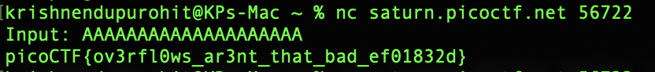

# 1. Buffer Overflow 0
Let's start off simple, can you overflow the correct buffer? The program is available _here_. You can view source _here_.
After launching instance - Connect using: nc saturn.picoctf.net 57780

## Solution
Upon analysis of the C source code, we see the function 'sigsegv_handler' which prints that secret if the program receives a segmentation fault (SIGSEGV). the challenge hint and the gets man page tells us that gets is an unsafe manner in which info is obtained and can be exploited by overflow attacks. Below is the manpage of gets

```
 The gets() function cannot be used securely.  Because of its lack of
     bounds checking, and the inability for the calling program to reliably
     determine the length of the next incoming line, the use of this function
     enables malicious users to arbitrarily change a running program's
     functionality through a buffer overflow attack.  It is strongly suggested
     that the fgets() function be used in all cases.  (See the FSA.)
```

The program also uses strcpy to move the obtained string into a much smaller buffer (16-byte). Therefore, if our input is above 16 bytes, we'll get the flag from the global flag buffer as SIGSEGV will be called (buffer overflows). 

Calling the nc connection we pass a relatively long string and Voilà.




## Flag: 
```
picoCTF{ov3rfl0ws_ar3nt_that_bad_ef01832d}
```

## Concepts learnt
This challenge required me to look into buffer overflows in C, I've looked into SIGSEGV and nc connections along with the gets command (and why it's not preffered and exposes a crucial vulnerability in the challenge). 


## Notes
Note to note here, challenge was self explainatory. Few trial and errors eventually gave the flag

## References
https://en.wikipedia.org/wiki/Segmentation_fault
https://www.varonis.com/blog/netcat-commands
https://stackoverflow.com/questions/1694036/why-is-the-gets-function-so-dangerous-that-it-should-not-be-used

***