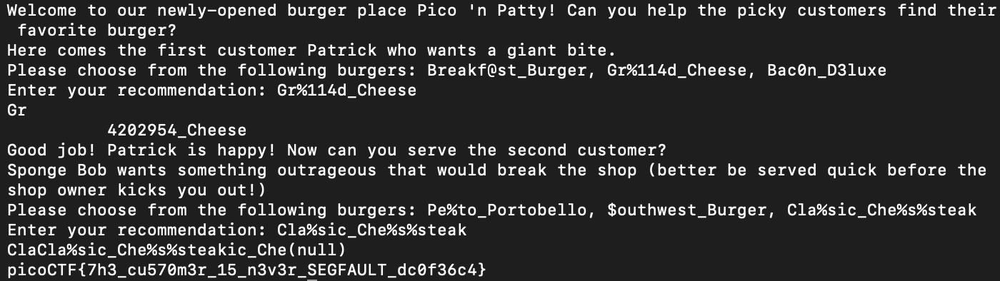

# 1. Buffer Overflow 0
Let's start off simple, can you overflow the correct buffer? The program is available _here_. You can view source _here_.
After launching instance - Connect using: nc saturn.picoctf.net 57780

## Solution
Upon analysis of the C source code, we see the function 'sigsegv_handler' which prints that secret if the program receives a segmentation fault (SIGSEGV). the challenge hint and the gets man page tells us that gets is an unsafe manner in which info is obtained and can be exploited by overflow attacks. Below is the manpage of gets

```
 The gets() function cannot be used securely.  Because of its lack of
     bounds checking, and the inability for the calling program to reliably
     determine the length of the next incoming line, the use of this function
     enables malicious users to arbitrarily change a running program's
     functionality through a buffer overflow attack.  It is strongly suggested
     that the fgets() function be used in all cases.  (See the FSA.)
```

The program also uses strcpy to move the obtained string into a much smaller buffer (16-byte). Therefore, if our input is above 16 bytes, we'll get the flag from the global flag buffer as SIGSEGV will be called (buffer overflows). 

Calling the nc connection we pass a relatively long string and Voilà.


## Flag: 
```
picoCTF{ov3rfl0ws_ar3nt_that_bad_ef01832d}
```

## Concepts learnt
This challenge required me to look into buffer overflows in C, I've looked into SIGSEGV and nc connections along with the gets command (and why it's not preffered and exposes a crucial vulnerability in the challenge). 


## Notes
Note to note here, challenge was self explainatory. Few trial and errors eventually gave the flag

## References
https://en.wikipedia.org/wiki/Segmentation_fault
https://www.varonis.com/blog/netcat-commands
https://stackoverflow.com/questions/1694036/why-is-the-gets-function-so-dangerous-that-it-should-not-be-used

***

# 2. Format String 0
Can you use your knowledge of format strings to make the customers happy? Download the binary *here*. Download the source *here*.
After running instance - Conncect via netcat 

## Solution
Just as the previous challenge, the source code utilises the SIGSEGV signal which prints the flag when activated. In the first interaction after the main function sets the program sandbox, serve_patrick() is called and it prompts us as the user and takes a string as choice1. But then we see this.

```C
int count = printf(choice1);
```

This line of code passes our string directly as the format string rather than as data. Therefore we see that any % sequences in the input will be interpreted by printf as format specifiers. Looking into the options their actual size are all the same as strings, the function only continues to the next "customer" if the string passed is greater than 64 bytes. The option "Gr%114d_Cheese" works here as %114, although not an actual format specifier in C When used like %114d, the 114 is a minimum field width. It tells printf to print the value in a field at least 114 characters wide and thus greatly increasing our size when passed into the size variable.

With that serve_bob() is called where we're told to deliver an "outrageous order". The source code has no checks, except for the previously declared SIGSEGV, so now we have to look for a string to pass as a format string to "crash" the program. Passing "Cla%sic_Che%s%steak" to the prompt, as %s is a format specifier, this crashes the program and gives us our flag. This call of string format specifiers which don't really interpet anything causes a segmentation error and causes the SIGSEGV function to activate and print our flag.



## Flag:
```
picoCTF{7h3_cu570m3r_15_n3v3r_SEGFAULT_dc0f36c4}
```

## Concepts Learnt
Format specifiers are the main takeaway here, this challenge gives us an idea of how they work and how they're subtly used in completing the challenge. Also looked into the nuances of the printf command during variable initialisation. 

## Notes
Quite an easy challenge, only required two tries. 

## References
https://www.geeksforgeeks.org/c/format-specifiers-in-c/
