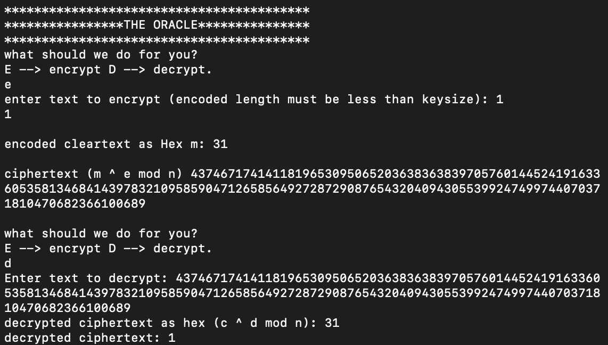
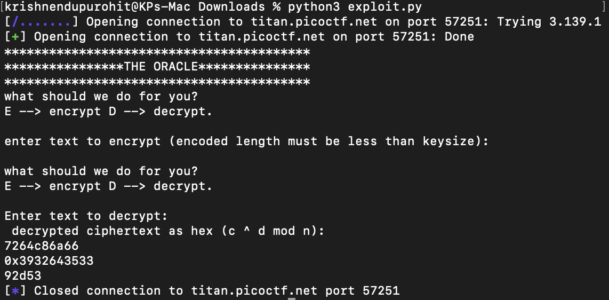

# 1. RSA Oracle
Can you abuse the oracle? An attacker was able to intercept communications between a bank and a fintech company. They managed to get the message (ciphertext) and the password that was used to encrypt the message.

After some intensive reconassainance they found out that the bank has an oracle that was used to encrypt the password and can be found here nc titan.picoctf.net 62153. Decrypt the password and use it to decrypt the message. The oracle can decrypt anything except the password.

## Solution:
Looking into the netcat connection we see the following



This hints at the fact that we need to use opennetcat to obtain the passkey to decrypt the secret.enc via password.enc. We can't seem to paste the raw bytes into the oracle as stated in the challenge prompt. The challenge prompts us to use "Chosen plaintext attack" and use openssl along with the passkey obtained to decrypt the secret.enc file to actual plaintext. 

This was difficult to understand but searching up RSA chosen plaintext attack via google we get a neat little repo on github which gave me a good idea of how we can approch this challenge.
RSA is multiplicative so we're going to try to create the actual password times two, and then divide it more-or-less to obtain the actual password, all while abusing the oracle without it knowing. We send the single byte \x02 as the plaintext to encrypt. That corresponds to the integer 2 (so the server will compute 2^e mod n). We recieve that and multiply it with the encrypted password to essentially get (2*pass). We decrypt this via the oracle and then transform the hex plaintext to int and divide it by two and convert it to binary and then into readable ascii, ths granting us the passkey to decode secret.enc. 

We do the above through a .py script with pwntools. 

```py
#!/usr/bin/env python3
from pwn import *

r = remote('titan.picoctf.net', 50808)
response = r.recvuntil(b'decrypt.')
print(response.decode())
payload = b'E' + b'\n'
r.send(payload)
response = r.recvuntil(b'keysize):')
print(response.decode())
payload = b'\x02' + b'\n'
r.send(payload)
response = r.recvuntil(b'ciphertext (m ^ e mod n)')
response = r.recvline()
enc2_str = response.strip().decode()
enc2 = int(enc2_str)
num = enc2 * 873224563026311790736191809393138825971072101706285228102516279725246082824238887755080848591049817640245481028953722926586046994669540835757705139131212
response = r.recvuntil(b'decrypt.')
print(response.decode())
payload = b'D' + b'\n'
r.send(payload)
response = r.recvuntil(b'decrypt:')
print(response.decode())
r.send(str(num).encode() + b'\n')
response = r.recvuntil(b'hex (c ^ d mod n):')
print(response.decode())
response = r.recvline().strip()
print(response.decode())
num_int = int(response.decode().strip(), 16) // 2
print(hex(num_int))
hex_string = hex(num_int)[2:]  # removing 0x from hex
if len(hex_string) % 2 == 1:
    hex_string = '0' + hex_string
byte_array = bytes.fromhex(hex_string)
print(byte_array.decode('ascii'))
r.close()
```

Running this grants us the passkey as shown: (had to launch another instance for this screenshot)



Now running this in the terminal, and pasing the passkey gives us the flag:
```zsh
openssl enc -aes-256-cbc -d -in secret.enc
```

## Flag
```
picoCTF{su((3ss_(r@ck1ng_r3@_92d53250}
```

## Concepts learnt.
This challenge forced me to learn a lot more about scripting in python with the pwntools library. I had to delve into numerous other ctf writeups to even gauge how remote was being used as I dud here. This also had me delve into hex-to-binary and binary-to-ascii via py which was a novel experience. Of course this also taught me about how RSA encryption functions and how we can reverse it through a simple trick when the oracle "checks" to prevent decoding our password.

`recvuntil(b'decrypt.')` reads until the server displays the menu prompt that includes the word decrypt.. That ensures we're synchronized with the server prompt.
we pass `b'E\n'` as a payload via the remote which selects the Encrypt option on the oracle menu.
We then wait and print the lines the netcat connection gives via `.recvline()` saving it all into a response variable.
we then pass two in a raw byte formatting as a payload. `payload = b'\x02' + b'\n'`

We save the server response taking in only the decimal number into a variable enc2. Multiply that with the passkey and then pass a decrypt payload and send it over. `str(num)` converts the integer to its decimal string representation `.encode()` turns that Python str into a bytes object using UTF-8 by default so there's no need to prefix a `b` before the argument. We obtain the decryption by stripping the output to a string after the oracle nc prompt completes and save it into the response variable. From there we do the convertion stated above in the solution.  

## Notes
This challenge was a pain to say the least. I had to begin looking into pwntools once more and had to do multiple revisions and research to obtain the above .py script. I also failed by trying to use the actual password.enc file instead of the decimal string by trying to pipe it into the script but I could not get that far. Decoding the remote responses was a chore and I also got stuck at the conversions. Failing to remove  the prefixed '0x' from the hex output and also failing to divide the actual integer in num variable. Requiring me to learn how to do so in py(It's called slicing) and delve into division operators. 

## References
https://en.wikipedia.org/wiki/UTF-8
https://docs.pwntools.com/en/dev/tubes/sockets.html#module-pwnlib.tubes.remote
https://github.com/zweisamkeit/RSHack/blob/master/Attacks/Chosen_Plaintext/chopla.py
https://en.wikipedia.org/wiki/RSA_cryptosystem
https://www.geeksforgeeks.org/computer-networks/rsa-algorithm-cryptography/
https://github.com/openssl/openssl
https://www.geeksforgeeks.org/python/string-slicing-in-python/
https://www.geeksforgeeks.org/python/division-operators-in-python/

***

# 2. Custom Encryption
Can you get sense of this code file and write the function that will decode the given encrypted file content. Find the encrypted file here flag_info and code file might be good to analyze and get the flag. 

## Solution 
This challenge utilises reverse xor to obtain the flag, here the cipher is obtained by passing the values of a and b from the program and passing it through a generator function, creating shared keys. Then making a semi_cipher and passing it into an encrption function once more which multiplies each char code by shared_key*311. 
The above is what we get from the provided challenge file, here the test key is "trudeau" which gives us the encrypted cipher in enc_flag. 

Reversing this we create the following .py script.

```py
def generator(g, x, p):
    return pow(g, x) % p
def dynamic_xor_encrypt(plaintext, text_key):
    cipher_text = ""
    key_length = len(text_key)
    for i, char in enumerate(plaintext[::-1]):
        key_char = text_key[i % key_length]
        encrypted_char = chr(ord(char) ^ ord(key_char))
        cipher_text += encrypted_char
    return cipher_text
a = 94
b = 21
p = 97
g = 31
cipher = [131553, 993956, 964722, 1359381, 43851, 1169360, 950105, 321574, 1081658, 613914, 0, 1213211, 306957, 73085, 993956, 0, 321574, 1257062, 14617, 906254, 350808, 394659, 87702, 87702, 248489, 87702, 380042, 745467, 467744, 716233, 380042, 102319, 175404, 248489]
v = generator(g, b, p)
k = generator(v, a, p)
print(k)
dc=""
for ch in cipher:
    dc += chr(ch // 311 // k)
print(dynamic_xor_encrypt(dc, "aedurtu")) #Before aedurtu we passed picoCTF{ to obtain the arrangement
```

Here we import the generator and xor encrypt functions from the original program. Now we take in the ciphers and divide them with the shared keys along with 311. This key is generated the same way we did in the original program. 
From here we pass the semi-decrypted string with a part of the flag which we know is present. i.e(picoCTF). We can use a known-plaintext snippet to derive how the key needs to be arranged (reverse + rotation) to align with the code’s reverse traversal for your exact message length. We see the arrangement of "trudeau" in the key and thus giving us the arranged key to pass once more. 


Passing it now as "aedurtu", the XOR lines up correctly. Giving us the flag.

## Flag
```
picoCTF{custom_d2cr0pt6d_8b41f976}
```

## Concepts learnt
The XOR cipher depends on the text key arrangement. Because the code iterates over the reversed plaintext, we must use the reversed/rotated version of the intended key so that, from the perspective of the forward plaintext, characters match the intended key letters.
This program essentially undoes whatever the custom encryption did to generate the cipher.

## Notes
This was quite straightforward, none to note here. Had to research a good chunk into XOR ciphers and reverse-engineering the code. Once again my biggest issue here was the trial and error in compiling the code.

## References
https://www.geeksforgeeks.org/python/get-the-logical-xor-of-two-variables-in-python/
https://www.geeksforgeeks.org/python/enumerate-in-python/
https://www.101computing.net/xor-encryption-algorithm/
https://www.geeksforgeeks.org/python/ord-function-python/

***

# 3. Mini RSA
What happens if you have a small exponent? There is a twist though, we padded the plaintext so that (M ** e) is just barely larger than N. Let's decrypt this: ciphertext

## Solution
We're given a ciphertext. RSA encryption uses the formula c = m^e mod(N) where m is plaintext, e is a public exponent, n is a product of two large primes(p and q). 
Decryption requires the private exponent d, which satisfies m = c^d mod(N); By essence only someone who knows p and q can compute d. 
In the challenge, the message was padded so that m^e is just slightly larger than N.
Which gives us m^e = c + iN for some small integer i.
To recover m, we try small values of i iterating all the way to 10000; Compute c + iN; Take the integer cube root of that number, we're using binary search method here as the numbers are so large. If (m^e) = c + kN is a perfect cube, you’ve found the plaintext m. 

Formatting this into a .py script we get the following:

```py
import binascii
n = 1615765684321463054078226051959887884233678317734892901740763321135213636796075462401950274602405095138589898087428337758445013281488966866073355710771864671726991918706558071231266976427184673800225254531695928541272546385146495736420261815693810544589811104967829354461491178200126099661909654163542661541699404839644035177445092988952614918424317082380174383819025585076206641993479326576180793544321194357018916215113009742654408597083724508169216182008449693917227497813165444372201517541788989925461711067825681947947471001390843774746442699739386923285801022685451221261010798837646928092277556198145662924691803032880040492762442561497760689933601781401617086600593482127465655390841361154025890679757514060456103104199255917164678161972735858939464790960448345988941481499050248673128656508055285037090026439683847266536283160142071643015434813473463469733112182328678706702116054036618277506997666534567846763938692335069955755244438415377933440029498378955355877502743215305768814857864433151287
e = 3

c =1220012318588871886132524757898884422174534558055593713309088304910273991073554732659977133980685370899257850121970812405700793710546674062154237544840177616746805668666317481140872605653768484867292138139949076102907399831998827567645230986345455915692863094364797526497302082734955903755050638155202890599808147276605782889813772992918898400408026067642464141885067379614918437023839625205930332182990301333585691581437573708925507991608699550931884734959475780164693178925308303420298715231388421829397209435815583140323329070684583974607064056215836529244330562254568162453025117819569708767522400676415959028292550922595255396203239357606521218664984826377129270592358124859832816717406984802489441913267065210674087743685058164539822623810831754845900660230416950321563523723959232766094292905543274107712867486590646161628402198049221567774173578088527367084843924843266361134842269034459560612360763383547251378793641304151038512392821572406034926965112582374825926358165795831789031647600129008730
def root(x,n):
    upp = 1
    while upp ** n <= x:
        upp *= 2
    low = upp // 2
    while low < upp:
        mid = (low+upp) // 2
        mid_n = mid ** n
        if low < mid and mid_n < x:
            low = mid
        elif upp > mid and mid_n > x:
            upp = mid
        else:
            return mid
    return mid + 1
for i in range(10000):
    str=("{:x}".format(root(c+i*n,3)))
    if "7069636f" in str:
        print (str)
        print(binascii.unhexlify(str))
```

Here the `**` is the exponentiation operator. This allows for a lossless compute of the power. binascii package helps us convert hex data into raw bytes. 
`"{:x}".format(...)` converts the integer root to a lowercase hexadecimal string (no 0x, just hex digits). You store that string in the variable named str.
The script checks if the substring "7069636f" appears in the hex representation here it's the representation of "pico" and we search for that hex subtstring in the final ascii hex. Printing us our flag.

## Flag:
```
picoCTF{e_sh0u1d_b3_lArg3r_85d643d5}
```

## Concepts Learnt
Learnt futher into RSA encrption and how we can compute integer cube roots of a large int via binary search. Leant the binascii package too as well as the exponential operator in py. 

## Notes 
This is said to be a rudimentary solution, I had to take external help for this as I wasn't able to figure out the math behind this. The references attached are insightful and gave me a better understanding of the topics. Very tough overall, had to try multiple failed iterations before eventually searching for more.

## References. 
https://riptutorial.com/python/example/8751/computing-large-integer-roots
https://www.geeksforgeeks.org/python/python-program-to-find-square-root-of-given-number/
https://docs.micropython.org/en/latest/library/binascii.html
https://www.datacamp.com/tutorial/exponents-in-python

***
# 4. MiniRSA 
Let's decrypt this: ciphertext? Something seems a bit small.

## Solution
We're given the ciphertext, exponent and public key.
Placing these into dcode or my above program (.py script) we get the flag

## Flag:
```
picoCTF{n33d_a_lArg3r_e_d0cd6eae}
```

## Concepts learnt
This once again builds off of an understanding of RSA encrpyption as the previous challenge.

## Notes
None to note here

## References 
https://www.dcode.fr/rsa-cipher
