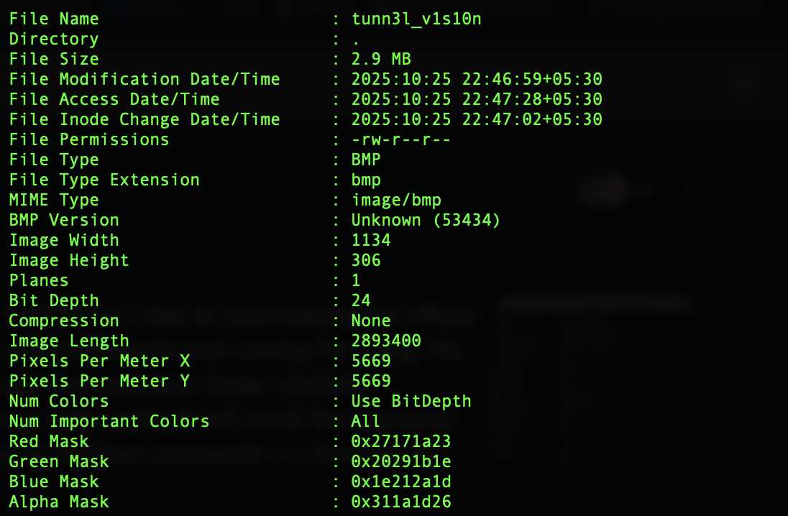
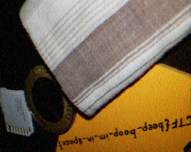

# 1. Tunn3l V1s10n
We found this file. Recover the flag.

## Solution 
Running exiftool on this file given to us gives us a hint that the flag is hidden somewhere in a .bmp image, this is in actuality the file given to us. 


Immediately changing the file extension gives us a broken link, so now we look into the hex headers of the file to see if we can try repairing anything. Crossreferencing a normal bitmap image we see that in the 14 bytes header, there are incorrectly placed bits. Here we change BA D0 00 00 to 28 00 00 00 as the header's total size should be of 40 bytes. Exporting this fixed version gives us the below image. 

.bmp "Initial repaired bitmap image")

The challenge name gives me an idea that this image is not the full picture so I look into changing the dimensions of the image. Changing the height of the image to 32 03 00 00 (after trial and error), we get the final flag and full image. 


## Flag:
```
picoCTF{qu1t3_a_v13w_2020}
```

## Concepts Learnt
This challenge required a lot of time an analysis with regards to .bmp hex formats as well as an idea of exiftool and connecting the dots with that along with a hex-editor. Here we also required to understand how we could manipulate the hex headers to obtain the full image. Looking into the dataoffset bits in the hex editor upon post-analysis tells us that the image is much larger than expected and that there's more to it(BA D0 00 00). 

## Notes
Here I had initially tried binwalk too, with no success, I had also tried changing file formats into .png etc. there were also a lot of trial and error in the hex editor as I could not quite understand what part of the headers did exactly what so this required further study. 

## Resources
https://www.donwalizerjr.com/understanding-bmp/

*** 

# 2. M00nwalk
Decode this message from the moon.

## Solution
This challenge relies heavily on the hints provided to us. Here the .wav file given to us along with the "moon" context tells us that the flag is hidden in an image transfered by SSTV protocol. Using this we pass the .wav file into a resource and obtain the image in which the flag lies.



## Flag:
```
picoCTF{beep_boop_im_in_space}
```

## Concepts learnt
Here I've delved further into how one can pass an image via audio. Looked into how slow scan television networks actually function.

## Notes
Here I had initially not read the hints provided and simply tried a spectogram via audacity to decipher any clues yielding nothing.

## Resources
https://sstv-decoder.mathieurenaud.fr/
https://en.wikipedia.org/wiki/Slow-scan_television  (for further learning as well as gaining the "Scottie" clue)

***

# 3. Trivial Flag Tansfer Protocol
Figure out how they moved the flag.

## Solution
The challenge name is a massive hint here, exporting the TFTF objects on wireshark from the given .pcapng file we get the following. 

Further using dpkg(instlled via homebrew) gives me the contents of the .deb file on mac as seen above.

Passing the contents of instructions and plan under ROT13 decoding. We get the following
`TFTPDOESNTENCRYPTOURTRAFFICSOWEMUSTDISGUISEOURFLAGTRANSFER.FIGUREOUTAWAYTOHIDETHEFLAGANDIWILLCHECKBACKFORTHEPLAN`
and 
`IUSEDTHEPROGRAMANDHIDITWITH-DUEDILIGENCE.CHECKOUTTHEPHOTOS`
This gives us a massive hint as to the fact that there is some data hidden in the three images provided. Inspecting the .deb file we see steghide too (under usr/bin/) which tells us that a steganographic decoder is required. 

Trying each image one by one through the passphrase `DUEDILIGENCE` (found after trial and error)
We get a hit on the third image. picture3.bmp
Yielding a text file and granting us the flag.

## Flag:
```
picoCTF{h1dd3n_1n_pLa1n_51GHT_18375919}
```

## Concepts Learnt
This challenge required the use of wireshark to analyse packets sent over a network protocol, furthermore requiring the use of steganographic decoders which we can use only after the de-encryption of the two txt files via ROT13. 

## Notes
Here this was a multitude of tangents from my part. Initially my version of wireshark (4.6.0) did not support this solve and I had to downgrade my version down (thanks Anshuman), furthermore it took me a while to realise that we must use steganography as I hadn't thought about looking into the .deb file.  Finally it was quite hard to realise the passphrase despite it being under my eyes the entire time. Tried binwalk on exiftool on the images too giving me nothing of note. 

## Resources
https://apple.stackexchange.com/questions/384181/installing-from-deb-files-in-macos-catalina
https://futureboy.us/stegano/decinput.html
https://cyberchef.org
https://www.dcode.fr/

***
