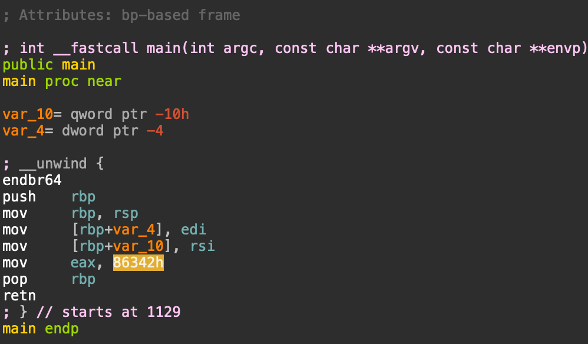

# 1. GDB Baby Step 1 
Can you figure out what is in the eax register at the end of the main function? Put your answer in the picoCTF flag format: picoCTF{n} where n is the contents of the eax register in the decimal number base. If the answer was 0x11 your flag would be picoCTF{17}. Disassemble this.

## Solution: 
Here we ustilise the IDA disassembler to view the contents of the file. Using which, we look into the main function via asm or graph view on IDA and extract the value of eax. Here the mov command directs the value on the right hand side into the register eax, the value followed by mov command is what is copied into eax after the main function call. i.e 86342h. This is in hexadecimal. We furthermore place this value into cyberchef to convert it from hexadecimal to decimal. 



## Flag 
```
picoCTF{549698}
```
## Concepts learnt:
This challenge inundates us into the utilisation of disassembly software to reverse engineer functions. This was a simple challenge which accquainted us to the disassembler and undertand the various sections to look out for. A disassembler generates assembly language source code from machine-executable code. Here we learnt the use of mov in asm interpretation and how it correlates into placing a value into a register(here, eax). Note that in assembly language, a register is a small, high-speed storage location, this is a temporary memory which is manipulated in processes. 

## Notes: 
I has initially places the literal file/memory address of the eax register into consideration, this was a crucial error and a misstep in me not reading the problem statement correctly. 

## Resources: 

IDA Free 9.0

Cyberchef (https://cyberchef.org/)

***

# 2. ARMssembly 1
