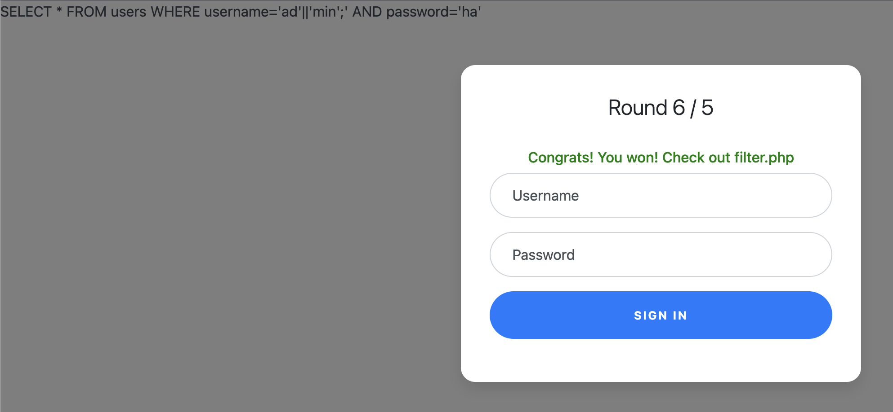

# 1. Web gauntlet
Can you beat the filters?

Additional details will be available after launching your challenge instance. (Sites are given after initialising the instance)

Log in as admin http://shape-facility.picoctf.net:50402/ http://shape-facility.picoctf.net:50402/filter.php

## Solution
The website interface along with its cloes give us the idea that we have to utilise some sql injection via the sqlite database. 
Running a default sql payload in the user, we get: 

`SELECT * FROM users WHERE username='admin' --' AND password='lol'`

Here we can ignore the AND password=’lol’ part by making it a comment. -- is one common sql comment that we utilise as a first payload. 
The next round after passing gives us a new flter applied to the user parameter, this is viewed in the second website given to us, the filter.php. Now -- is omitted from our use. I then assume we can simply let the command terminate after the username. Hence the payload is now - `admin';` we get:

`SELECT * FROM users WHERE username='admin'; AND password='haha'`

The same payload works for the next round (as the filer only blocked out /* after round 2, which is another way to make a comment in sql)

Round 4 omits the admin keyword so we then proceed to using the concat operator in sql (after multiple rounds of trial and error)
making the payload look like
`adm'||'in';`



This same payload works for the next and final round. This yields a final flag under filter.php


## Flag:
```
picoCTF{y0u_m4d3_1t_79a0ddc6}
```

## Concepts learnt
This challenge reqired a further study into sql operators and comments to modify the injection payloads. I've learnt the operators used to make sql comments as well as the concat operator.

## Notes
Here there weren't any incorrect tangents but moreso failed attempts after round 3 as admin was blocked and I struggled to create a tangible payload to break the filter. This had me research a lot more into sqlite and got towards the concat operator.

## Resources
https://www.geeksforgeeks.org/sql/sql-concatenation-operator/
https://www.w3schools.com/sql/sql_comments.asp
https://github.com/payloadbox/sql-injection-payload-list

***

# 2. Cookies
Who doesn't love cookies? Try to figure out the best one. http://mercury.picoctf.net:17781/

## Solution
In the website we can take a look at the textbox as given below, prompting us to type in some "cookie" of our choice. //text hints us at typing snickerdoodle


Placing a "valid cookie" under the textbox and inspecting the actual page cookies, we see the following passed. Here I've written "chocolate chip"


The original value of the cookie at the homepage was -1 and hence we see with each new variant of a cookie passed to the site, the value increments. 

Using trial and error, incrementing the cookie value by two we eventually strike the flag at the cookie value '18'.

## Flag
```
picoCTF{3v3ry1_l0v3s_c00k135_bb3b3535}
```

## Concepts learnt
This requires an understanding of how cookies work and how to modify it via inspection of the page. 

## Notes
None to place here, pretty straightforward challenge, simple trial and errors from my part. 

## References
https://developer.mozilla.org/en-US/docs/Web/HTTP/Guides/Cookies (for further reading)

***

***

# 3. SSTI 1
I made a cool website where you can announce whatever you want! Try it out!
After launching instance: I heard templating is a cool and modular way to build web apps! Check out my website here!

## Solution
This challenge's hint is the focal point at which we focus on. Looking at the website we get this neat little text box to "announce" whatever we wish.


Passing the string we get:


From here I look into some sanity checks and phrases we can use to figure out the server engine. (We can also use curl for this but I wanted to research a little more on web exp.) Passing `{{7*7}}` as a payload, we get:


This means the payload actually remotely executed code at serverside. This template gives 49 in Twig, 7777777 in Jinja2. 
Looking into exploitation techniques in jninja2, we get the following template as a payload. 

`{{self._TemplateReference__context.cycler.__init__.__globals__.os.popen("ls").read()}}`

Which returns:


Okay now we're getting somewhere, let's try catting this flag

`{{self._TemplateReference__context.cycler.__init__.__globals__.os.popen("cat flag").read()}}`

We get the flag from this

## Flag: 
```
picoCTF{s4rv3r_s1d3_t3mp14t3_1nj3ct10n5_4r3_c001_dcdca99a}
```

## Concepts learnt
This challenge taught us further in how we can identify server engines by a framework of templates, I also learnt a bit of syntax with respect to the `curl` command. Learnt a good chunk on how different payloads affect various engines and how they actually work under the hood. Here jninja2 operates on anything under the `{{...}}` and `self._TemplateReference__context` tries to access the internal template context object (in this context its a data structure that makes variables and functions available for use within a template). `.popen("cat flag").read()` — uses os.popen() to execute a shell command (cat flag) and read its output. 
 
## Notes
Here I tried more rudimentary methods to get the flag which were incorrect, took me a while to get to the server side template injection part. I tried a few things from web gauntlet to no avail too. Research into this took longer than expected. Tried simple payloads such as `{{ls}}` which failed.

## References
https://www.yeswehack.com/learn-bug-bounty/server-side-template-injection-exploitation
https://owasp.org/www-project-web-security-testing-guide/v41/4-Web_Application_Security_Testing/07-Input_Validation_Testing/18-Testing_for_Server_Side_Template_Injection
https://portswigger.net/research/server-side-template-injection#Identify
https://pushmetrics.io/learn/jinja/what-is-jinja/
https://www.geeksforgeeks.org/linux-unix/curl-command-in-linux-with-examples/

