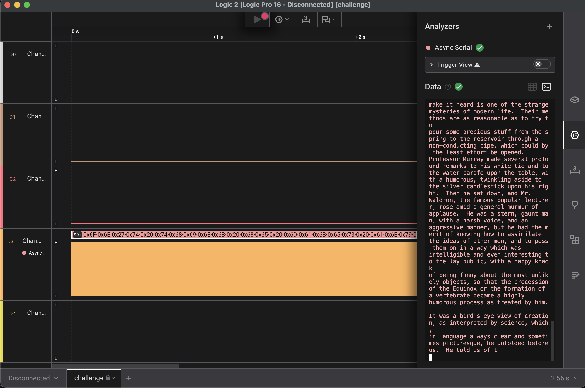
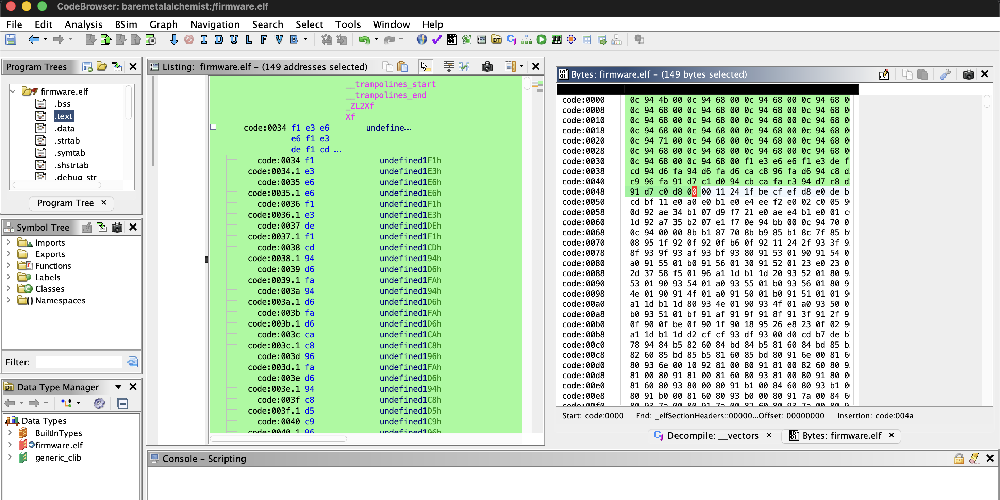
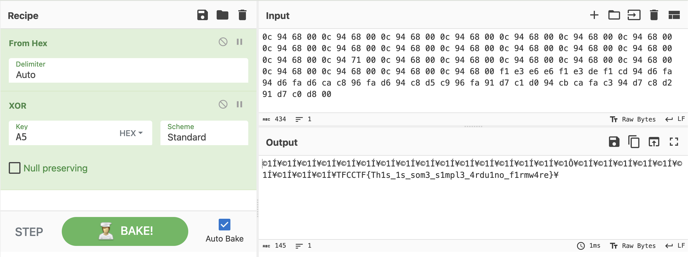

# 1. IQ-Test
Let your input x = 30478191278.

wrap your answer with nite{ } for the flag.

As an example, entering x = 34359738368 gives (y0, ..., y11), so the flag would be nite{010000000011}.


## Solution 
Manually plugging in the binary for x, we get this
`11100011000101001000100101010101110`

Now running through the entire logic gate sequence manually assigning each bit to x0,x1 and so on, we get the desired output and flag. 

## Flag
```
nite{100010011000}
```

## Concepts learnt
This was by essence a soild revision of logic gates, giving a good idea of repeating patterns and gate equations.

## Notes
i initially tried the lazy yet complicated route of trying to script a .py program to do the gate solving ourselves. Immediately relising I was way out of my depth here and giving up. If you're curious I'm more than happy to share how far I got. But yes I just decided to manually plug in the values and get the flag.

## References
https://www.geeksforgeeks.org/python/logic-gates-in-python/
https://www.geeksforgeeks.org/utilities/decimal-to-binary/


***


# 2. I like logic
i like logic and i like files, apparently, they have something in common, what should my next step be.
Attached is a challenge.sal file

## Solution
This challenge required us to install logic2 from saleae. Placing the challenge file under logic2, we open its capture, export a .csv file and see that in channel 3 there is a significant amount of data. We use a UART analyser here (async serial) and calibrate it to default conditions, with baudrate as 9600. Looking into channel 3 we get the following 



In the midst of this data, we find the flag

## Flag:
```
FCSC{b1dee4eeadf6c4e60aeb142b0b486344e64b12b40d1046de95c89ba5e23a9925} ⁠
```

## Concepts learnt
Saleae Logic Analyzer is a small hardware device (and software) used to “listen” to electronic signals—basically digital voltages that go HIGH (1) or LOW (0).
UART stands for Universal Asynchronous Receiver/Transmitter which is used to transfer data amongst electonics. This analyser selected also has a baud rate, which defines how fast the bits are sent between the two ports. In the capture, channel 3 had a fast toggling signal while the others were flat which is a classic sign of UART data. 

## Notes
This challenge was tough to say the least, for some reason here I became perhaps inept to solve anything and begain converting the .sal file to zip and tring to analyse the .bin files under the .sal. Giving me nothing of note. Then I began trying to install logic2 only to immediately not even try analysing anything and assume something was from my system. I have no idea why I was so off today but that's that.

## References
https://en.wikipedia.org/wiki/Logic_analyzer
https://www.geeksforgeeks.org/computer-networks/universal-asynchronous-receiver-transmitter-uart-protocol/
https://www.youtube.com/watch?v=Ak9R4yxQPhs

***

# 3. Bare Metal Alchemist
my friend recommended me this anime but i think i've heard a wrong name.
Attached is an elf file

## Solution
This solution required a proper disassembly of the file. Opening it on ghidra we see the following


Prompted by the hint of XOR I proceed to look into the main function, and under LAB_code_0121. Here we find the following

```asm
       code:0110 95 ea           ldi        R25,0xa5
       code:0111 b9 2e           mov        R11,R25
```

Here the XOR key is `0xA5`, it's A5 essentially. Ldi loads an immediate value into a register here it's R25. eor is bitwise XOR. lpm esentially loads a program from flash memory. Z seems to be a pointer which the program utilises repeatedly, it's been initiallised to:

```asm
       code:011c 88 e6           ldi        R24,0x68
       code:0122 84 91           lpm        R24,Z
```

A z-register refers to a 16-bit address pointer register in some microcontrollers. This ties in to our .elf file being of AVR format, usually used in aurduinos. Now further analysing the code we get zlo which registers itself to the LSB of some memory. Therefore we can sort of tell that this program at the very least is performing this
"The ciphertext is a null-terminated byte string starting at flash address 0x0068, and the plaintext is cipher[i] ^ 0xA5."

Now searching the program for any memory/data outside of code we see this: 




Bingo, we copy and paste the bytes into cyberchef and run an XOR formula with the key being `A5`




## Flag:
```
TFCCTF{Th1s_1s_som3_s1mpl3_4rdu1no_f1rmw4re}
```

## Concepts learnt 
This challenge required a shift from IDA free to ghidra as IDA couldn't disassemble the file. So the first solve of the program was actually done via trying to look at the AVR-objdump I took via the terminal running this command. 
```zsh
avr-objdump -d firmware.elf > firmware.disasm
```
I had to leave the challenge as is for a while because ibus took way too long to download jdk25 and ghidra.
Once again this challenge required a good understanding of hex bytes, asm scripts/syntax and navigation of ghidra as well as greasping an overall idea of disassembly and reverse engineering a program. 

Overall fun solve even though I don't feel like I got the full picture. 

## Notes
Looking into ghidra I felt very confused as I wasn't able to decipher anything. Couldn't really understand where to look to begin with. Addresses and keeping track of registers were also hard to do. I was pretty much carried by the hint of xor and looked solely into the sections that had eor. It took an embarassing amount of time and for that I'm ashamed.

## References
https://cyberchef.org/
https://www.avrfreaks.net/s/topic/a5C3l000000UCjREAW/t062739
https://en.wikipedia.org/wiki/AVR_microcontrollers
https://share.google/OaDX7rEZQGs8WltOE
https://www.youtube.com/watch?v=fTGTnrgjuGA
https://man.archlinux.org/man/extra/avr-binutils/avr-objdump.1.en
